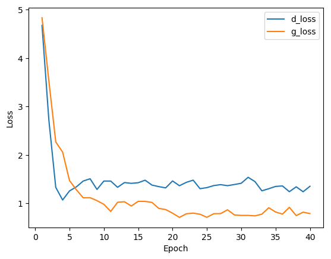
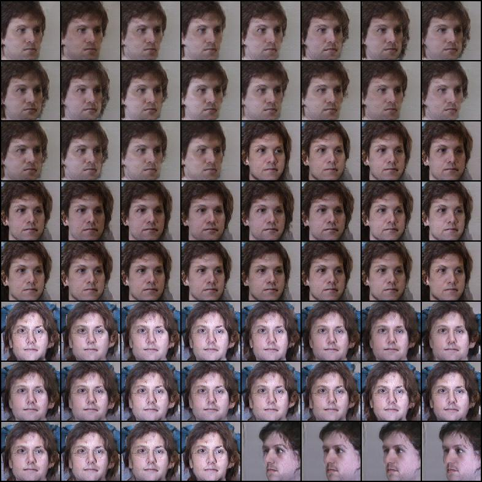
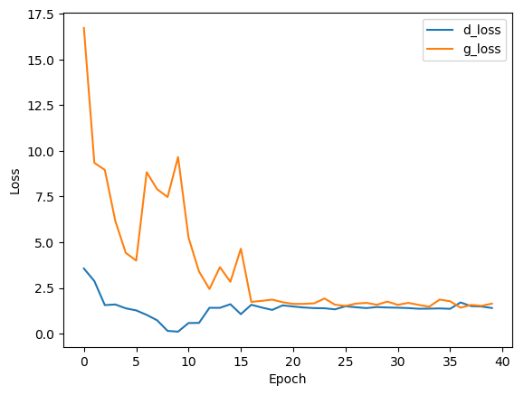

# myDRGAN
Pytorch implimentation of《2017CVPR-Representation Learning by Rotating Your Faces》, which is relied on [kayamin's implement of DR-GAN](https://github.com/kayamin/DR-GAN).

CVPR2017: [Representation Learning by Rotating Your Faces](http://cvlab.cse.msu.edu/pdfs/Tran_Yin_Liu_CVPR2017.pdf)

we trained the network using multiPIE and evaluated it for face recognition.

## Usage
look at document tree and see each file for more details, we can modify dataset and training parameters to run it:
```
myDRGAN
│  continue_scripts.sh
│  generate_multi.sh
│  generate_single.sh
│  iden_multi.sh
│  iden_single.sh
│  main.py
│  README.md
│  train_multi.sh
│  train_single.sh
│
├─.vscode
├─data
│      data.py
│      datdaset guide.pdf
│      mydataset.py
│      __init__.py
│
├─model
│      model.py
│      multiple_DR_GAN_model.py
│      multiple_DR_GAN_model_old.py
│      single_DR_GAN_model.py
│      single_DR_GAN_model_old.py
│      weights.py
│      __init__.py
│
├─run
│      generate_image.py
│      representation_learning.py
│      run.py
│      scheduler.py
│      train_multiple_DRGAN.py
│      train_single_DRGAN.py
│      __init__.py
│
├─snapshot
│  └─bestmodel
│          goodgen_multi_G.pth
│          goodgen_single_G.pth
│          goodiden_multi_G.pth
│          goodiden_single_G.pth
│
└─util
        myacc.py
        mybuffer.py
        mylog.py
        mytranmodel.py
        __init__.py
```

there are scripts to run DRGAN, we can modify some parameters in scripts: 

generate images
```
generate_multi.sh
generate_single.sh
```
identity recognition
```
iden_multi.sh
iden_single.sh
```
train model
```
train_multi.sh
train_single.sh
```

## Experiments
The experiments in following are preliminary(something maybe wrong), we are supposed to explore more details. But I am sorry to leave this reposity to start carrying out other assignments. 

### single DRGAN
batch_size:
```
64
```
data prepeocess:
```
transforms.CenterCrop(150)
transforms.RandomCrop(96)
```
policy:
```
if epoch<2**1+3: ratio=1+1 # 1:1
elif epoch<2**2+3: ratio=2+1 # 1:2
elif epoch<2**3+3: ratio=3+1 # 1:3
elif epoch<2**4+3: ratio=4+1 # 1:4
elif epoch<2**5+3: ratio=5+1 # 1:5
elif epoch<2**6+3: ratio=6+1 # 1:6
```
total epoches:
```
40
```

plot loss



generate images



identification rate

degree | 0 | 15 | 30 | 45 | 60 
---| --- | --- | --- | --- | --- 
goodiden| 86.8 | 91.4 | 91.1 | 87.4 | 81.8
goodgen | 88.7 | 91.8 | 90.1 | 86.1 | 81.2

we have higner iden rate but the generated images are really ugly.

### multi DRGAN
imagesperID:
```
6
```
batch_size:
```
60
```
preprocess:
```
transforms.CenterCrop(150)
transforms.RandomCrop(96)
```
policy:
```
if epoch<2**1+1: ratio=2**0+1 # 1:1
elif epoch<2**2+1: ratio=2**1+1 # 1:2
elif epoch<2**3+1: ratio=2**2+1 # 1:3
elif epoch<2**4+1: ratio=2**3+1 # 1:4
elif epoch<2**5+1: ratio=2**4+1 # 1:8
```
total epoches:
```
40
```

plot loss



generate images(really poor)


identification rate

degree | 0 | 15 | 30 | 45 | 60 
---| --- | --- | --- | --- | --- 
goodiden| 89.5 | 93.5 | 92.7 | 89.4 | 85.1
goodgen | 88.6 | 91.0 | 89.4 | 83.3 | 76.4

we have higner iden rate but the generated images are really ugly.

Good iden rate doesn't mean good generatation, we can see the comparision in snapshot file.

some models: [bestmodel in baidudisk](https://pan.baidu.com/s/1skEVB2X) password: bc97